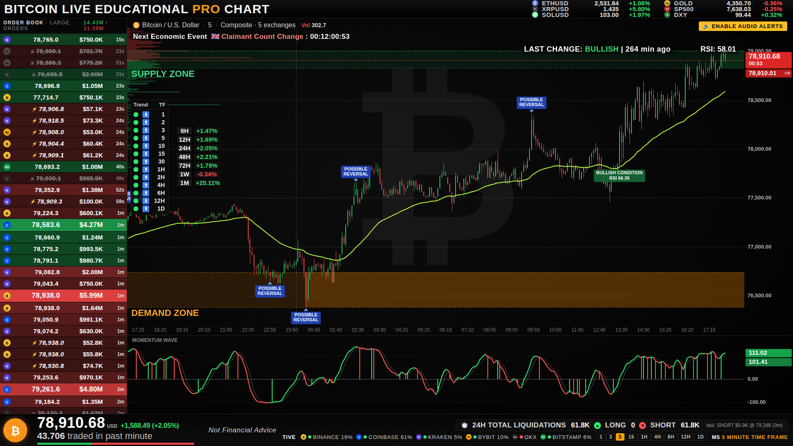

# BTC Monitor — Bitcoin Live Educational Pro Chart

Reconstruction d'un tableau de bord éducatif de surveillance du marché Bitcoin :
graphique en chandeliers **composite multi-exchanges** (Binance, Coinbase, Kraken,
Bybit, OKX, Bitstamp fusionnés en un indice pondéré par les volumes), surveillance du
carnet d'ordres agrégé, scanner de tendance multi-timeframes, zones d'offre / demande,
retournements possibles, RSI, oscillateur « Momentum Wave », suivi de la condition de
marché, liquidations longs / shorts 24 h, calendrier économique avec compte à rebours,
panneau multi-actifs et alertes visuelles + sonores.

Application **Node.js** (serveur d'agrégation) + interface web (canvas), interface en
anglais comme l'original. Fonctionne dans un navigateur ou comme *source navigateur* OBS.



---

## 1. Lancement rapide

**Windows — sans rien installer** : double-cliquer sur **`BTC-Monitor.exe`** (ou sur `Lancer BTC Monitor.bat`).
Une fenêtre de console s'ouvre (la garder ouverte pendant le direct, la fermer arrête le serveur) et le
tableau de bord s'ouvre tout seul dans le navigateur sur http://localhost:8787. `Lancer simulation.bat`
démarre le mode simulation (marché synthétique, sans internet).

* L'exécutable contient le serveur, l'interface et une copie du réglage par défaut ; au premier lancement il
  crée `config.js` à côté de lui (à éditer pour changer les réglages) et le dossier `data/`.
* Les fichiers `public/` présents à côté de l'exécutable sont utilisés en priorité (l'interface reste modifiable).
* Windows SmartScreen peut afficher « Windows a protégé votre ordinateur » car l'exécutable n'est pas signé :
  cliquer sur *Informations complémentaires* → *Exécuter quand même*. (`BTC-Monitor.exe` est le node.exe
  officiel de nodejs.org dans lequel le programme est injecté, voir `tools/build-exe.js` ; `npm run build:exe`
  le reconstruit.)
* Options en ligne de commande : `BTC-Monitor.exe --sim`, `--port 9000`, `--no-open`.

**macOS / Linux** : double-cliquer sur `start.command` (macOS) ou lancer `./start.sh` — Node.js ≥ 18 requis
(https://nodejs.org) ; les dépendances s'installent seules au premier lancement.

**Avec Node.js (toutes plateformes, développement)** :

```bash
cd btc-monitor
npm install          # une seule dépendance : ws
npm start            # données live multi-exchanges (ajouter --open pour ouvrir le navigateur)
```

Ouvrir ensuite **http://localhost:8787** dans un navigateur (Chrome / Edge / Firefox).

### Une page par timeframe

Le même serveur alimente autant de pages que voulu, **une page = un timeframe** :

| Timeframe | Adresse |
|---|---|
| 1 min | http://localhost:8787/?tf=1m |
| 3 min | http://localhost:8787/?tf=3m |
| 5 min (défaut) | http://localhost:8787/?tf=5m |
| 15 min | http://localhost:8787/?tf=15m |
| 1 h | http://localhost:8787/?tf=1h |
| 4 h | http://localhost:8787/?tf=4h |
| 8 h | http://localhost:8787/?tf=8h |
| 12 h | http://localhost:8787/?tf=12h |
| 24 h (journalier) | http://localhost:8787/?tf=1d |

Les boutons `1 3 5 15 1H 4H 8H 12H 1D` en bas à droite ouvrent chaque timeframe (Ctrl/Cmd + clic
pour un nouvel onglet). Chaque page reçoit ses propres bougies, EMA, RSI, Momentum Wave, zones,
retournements, condition de marché et alertes ; le carnet, les liquidations, le scanner, le calendrier
et le panneau multi-actifs sont communs. Dans OBS, ajouter une source navigateur par timeframe.

Autres commandes :

| Commande | Rôle |
|---|---|
| `npm start` | serveur live (port 8787 par défaut) |
| `npm run sim` | mode **simulation** : marché synthétique, aucune connexion internet nécessaire |
| `node server/index.js --port 9000` | changer le port |
| `npm test` | tests unitaires (indicateurs, moteur, parseurs des exchanges) |
| `npm run build:demo` | génère `dist/demo.html`, une page autonome (simulation embarquée) |
| `npm run build:exe` | reconstruit `BTC-Monitor.exe` (Windows x64) à partir des sources |

### Utilisation dans OBS

1. Lancer `BTC-Monitor.exe` (ou `npm start`) et le laisser tourner pendant le direct.
2. Sources → **+** → *Source navigateur*.
3. URL : `http://localhost:8787` (ou `http://localhost:8787/?tf=15m` pour un autre timeframe) — largeur 1920, hauteur 1080.
4. Cocher *Contrôler l'audio via OBS* pour entendre les alertes sonores dans le flux.

---

## 2. Configuration — `config.js`

Tout se règle dans `config.js` (redémarrer le serveur après modification).

| Section | Réglages principaux |
|---|---|
| `port` | port HTTP / WebSocket du tableau de bord |
| `chartTimeframe` | timeframe affiché quand la page est ouverte sans `?tf=` (défaut `5m`) |
| `chartTimeframes` | timeframes disponibles en pages : `1m 3m 5m 15m 1h 4h 8h 12h 1d` |
| `icons` | logos : téléchargés une fois depuis GitHub (organisations officielles des exchanges, dépôt `spothq/cryptocurrency-icons` pour les cryptos) dans `data/icons/`, sinon monogrammes intégrés |
| `visibleCandles` | nombre de bougies affichées (molette de la souris pour zoomer) |
| `exchanges` | exchanges fusionnés dans le chandelier composite (`enabled: true/false`, symbole) |
| `referenceExchange` | exchange dont le dernier prix est affiché comme étiquette secondaire (`CB` = Coinbase) |
| `liquidations` | flux de liquidations futures agrégés (Binance USDT-M + COIN-M, Bybit, OKX) |
| `orderBook` | seuils du moniteur de carnet : `largeOrderUsd` (taille mini d'un ordre listé), `minRestMs` (temps de repos mini), `feedRangePct`, `largeTradeUsd`, `bucketUsd` (profil de liquidité) |
| `indicators` | longueurs EMA / RSI, seuils de surachat-survente, EMA du scanner, fenêtre des zones, seuils du Momentum Wave, confirmation de la condition de marché |
| `assets` | panneau multi-actifs : source `binance` / `coinbase` (crypto, temps réel) ou `yahoo` (or, S&P 500, DXY…) |
| `calendar` | calendrier économique : flux hebdomadaire public, impact minimum, événements manuels |
| `alerts` | alertes audio / visuelles activées |
| `proxy` | proxy HTTP(S) sortant optionnel (réseaux d'entreprise) |

Exemple d'événement manuel :

```js
manualEvents: [
  { time: '2026-09-17T18:00:00Z', country: 'USD', title: 'FOMC Rate Decision', impact: 'High' },
],
```

---

## 3. Ce que montre chaque élément

| Élément | Fonctionnement |
|---|---|
| **Chandelier composite** | À chaque transaction reçue, un *prix indice* est recalculé : moyenne des derniers prix de chaque exchange pondérée par son volume récent (décroissance exponentielle 15 min, les flux muets > 60 s sont exclus). Les bougies (13 timeframes) sont construites sur cet indice ; le volume est la somme des exchanges. L'historique est chargé par REST sur chaque exchange puis fusionné (OHLC pondérés par les volumes). |
| **EMA 50** (ligne vert citron) | Tendance du timeframe du graphique ; sert aussi à la condition de marché. |
| **SUPPLY ZONE / DEMAND ZONE** | Recalculées **à chaque clôture de bougie** : la zone d'offre part du plus haut des `zoneLookback` dernières bougies clôturées (288 bougies, soit 24 h en 5 min, 12 jours en 1 h…) et descend de max(amplitude de cette bougie, 1 ATR) ; la zone de demande part du plus bas et monte de la même épaisseur. La bande est pleine à partir de la bougie qui a formé l'extrême et estompée avant. Quand une clôture dépasse l'extrême, la zone se déplace sur le nouveau sommet / creux ; quand l'ancien extrême sort de la fenêtre, elle glisse sur le suivant. La bougie en cours n'est jamais prise en compte (règle de confirmation). |
| **POSSIBLE REVERSAL** | Croisement du Momentum Wave sous / sur son signal peu après un extrême (Wave ≥ ±120 ou RSI ≥ 70 / ≤ 30). Le marqueur est posé sur le plus haut / plus bas de la fenêtre. Sur la bougie en cours il apparaît en transparence (*non confirmé*) et n'est validé qu'à la clôture — règle de confirmation de bougie. |
| **RSI** | RSI 14 (Wilder). Surachat ≥ 70 / survente ≤ 30 : halo rouge / vert, bandeau et son. |
| **MOMENTUM WAVE** (panneau bas) | Oscillateur de momentum (type WaveTrend ×2, plage ≈ ±250). Vert quand il est au-dessus de son signal, rouge sinon ; les barres verticales marquent les croisements. |
| **LAST CHANGE : BULLISH / BEARISH** + étiquette **BULLISH / BEARISH CONDITION** | Condition de marché : clôture au-dessus / en dessous de l'EMA 50, changement validé après `conditionConfirmBars` (2) clôtures consécutives de l'autre côté. Le texte en haut à droite donne l'état courant et l'ancienneté du dernier changement ; l'étiquette verte / rouge posée sur la bougie du changement (*BULLISH CONDITION* + RSI à cet instant) le situe sur le graphique ; un son est joué à chaque bascule. |
| **Trend / TF** (scanner) | Pour chaque timeframe 1 m → 1 D : pastille verte si la clôture est au-dessus de l'EMA 21 de ce timeframe, flèche ⬆ si l'EMA monte. |
| **6H … 1M** | Variation du prix indice par rapport à la clôture 6 h, 12 h, 24 h, 48 h, 72 h, 1 semaine et 30 jours plus tôt. |
| **Colonne gauche** (carnet d'ordres) | Les plus gros ordres limites **au repos** agrégés sur tous les exchanges (≥ `largeOrderUsd`, à ± `feedRangePct` du prix, présents depuis ≥ `minRestMs`), les plus récents en haut ; vert = achat (bid), rouge = vente (ask), l'intensité suit la taille. Le logo indique l'exchange (survol = nom + état) ; `✕` ordre retiré / exécuté (barré), `⚡` transaction unitaire ≥ `largeTradeUsd`. L'âge est le temps depuis l'apparition de l'ordre. |
| **Profil de liquidité** (barres à gauche du graphique) | Liquidité agrégée du carnet par tranche de `bucketUsd` : vert = bids, rouge = asks. |
| **24H TOTAL LIQUIDATIONS** | Somme glissante 24 h des liquidations futures (Binance, Bybit, OKX) : LONG = positions longues liquidées, SHORT = positions courtes. Persisté dans `data/liquidations.json` pour survivre aux redémarrages. |
| **Next Economic Event** | Prochain événement (impact ≥ `minImpact`) du flux hebdomadaire public + événements manuels, compte à rebours `JJ:HH:MM:SS`. |
| **Panneau multi-actifs** | ETH, XRP, SOL en temps réel (Binance), GOLD / SP500 / DXY par sondage (Yahoo Finance, ~90 s). |
| **Bas de page** | Prix indice, variation 24 h, volume échangé sur la dernière minute (tous exchanges) avec jauge achat / vente, état des sources (pastilles + part de volume), timeframe. |

« **Composite · 5 exchanges** » dans l'en-tête indique que le chandelier est l'indice composite de 5 exchanges
connectés ; « **Simulated composite** » signifie que le serveur tourne en mode simulation (`npm run sim`, ou
la page démo autonome) : les bougies, ordres et liquidations sont générés par le simulateur, pas par des exchanges.

Raccourcis : **M** = couper / réactiver le son, molette sur le graphique = zoom.

---

## 4. Architecture

```
btc-monitor/
├── BTC-Monitor.exe           lanceur Windows autonome (serveur + interface, sans Node.js)
├── Lancer BTC Monitor.bat    lanceur Windows (exe, ou Node.js si présent)
├── Lancer simulation.bat     idem en mode simulation
├── start.command / start.sh  lanceurs macOS / Linux (Node.js requis)
├── config.js                 réglages
├── server/
│   ├── index.js              serveur HTTP + WebSocket, orchestration
│   ├── net.js                WebSocket reconnectant, fetch, proxy optionnel
│   ├── history.js            chargement de l'historique multi-exchanges
│   ├── calendar.js           calendrier économique
│   ├── assets.js             cotations Yahoo Finance (or, indices, DXY)
│   ├── icons.js              logos (GitHub) mis en cache dans data/icons
│   └── feeds/                un adaptateur par exchange (trades, carnet, liquidations, historique)
│       ├── binance.js  coinbase.js  kraken.js  bybit.js  okx.js  bitstamp.js
├── core/                     moteur partagé (Node + navigateur)
│   ├── indicators.js         SMA, EMA, RSI, ATR, Momentum Wave, tendance, variations
│   ├── candles.js            timeframes, séries de bougies, fusion composite
│   ├── analysis.js           zones, retournements, condition, scanner, variations
│   ├── engine.js             prix indice, bougies live, carnet agrégé, feed, liquidations, messages
│   └── sim.js                générateur de marché synthétique
├── public/                   interface (index.html, styles.css, chart.js, app.js, audio.js, util.js)
├── tools/build-demo.js       page démo autonome
├── tools/build-exe.js        construction de BTC-Monitor.exe (esbuild + Node SEA + postject)
└── test/run.js               tests
```

Flux : exchanges → adaptateurs (événements normalisés) → `Engine` → messages WebSocket
(`snapshot`, `tick`, `analysis`, `book`, `orders`, `liq`, `scanner`, `pct`, `assets`,
`calendar`, `status`, `alert`) → interface. Plusieurs clients (navigateur + OBS) peuvent
être connectés en même temps. `GET /api/state` renvoie l'état complet en JSON.

---

## 5. Dépannage

* **« WAITING FOR MARKET DATA »** : le serveur n'a encore reçu aucune transaction.
  Regarder la console du serveur — chaque exchange y indique ses erreurs.
* **Binance / Bybit / OKX inaccessibles** : ces exchanges bloquent certains pays (États-Unis
  notamment). Désactiver l'exchange dans `config.js` (`enabled: false`) ; le composite
  fonctionne avec les autres. Les données de marché Binance passent par les points d'accès
  `data-api.binance.vision` / `data-stream.binance.vision`, disponibles partout ; seul le flux
  de liquidations futures (`fstream.binance.com`) reste soumis aux restrictions.
* **Pas d'or / S&P 500 / DXY** : Yahoo Finance limite parfois les requêtes (le serveur attend
  5 minutes puis réessaie). Les autres actifs continuent de se mettre à jour.
* **Pas d'événement économique** : le flux hebdomadaire n'est pas joignable ; ajouter des
  `manualEvents` dans `config.js`.
* **Logos** : Binance, Coinbase, Kraken, Bybit et OKX viennent de l'avatar de leur organisation GitHub
  officielle, BTC/ETH/XRP/SOL du dépôt `spothq/cryptocurrency-icons` (copies livrées dans `data/icons/`,
  re-téléchargées si absentes). Bitstamp n'a pas d'organisation GitHub officielle avec logo : un monogramme
  vert est utilisé — déposer `data/icons/bitstamp.png` ou indiquer une adresse dans `config.js` →
  `icons.sources` pour le remplacer.
* **Pas de son** : les navigateurs exigent un clic sur la page avant de jouer un son —
  cliquer sur *ENABLE AUDIO ALERTS* (dans OBS, cocher *Contrôler l'audio via OBS*).
* **Réseau avec proxy** : renseigner `proxy` dans `config.js` puis
  `npm install https-proxy-agent@7 undici`.

## 6. Limites connues

* Le flux de liquidations Binance ne publie qu'une liquidation par seconde et par symbole
  (limite de Binance) : les totaux sont indicatifs.
* Les paires USDT (Binance, Bybit, OKX) et USD (Coinbase, Kraken, Bitstamp) sont fusionnées
  sans conversion (option `normalizeUsdt: true` pour appliquer le cours USDT/USD de Kraken).
* Les cotations traditionnelles utilisent un point d'accès public non officiel de Yahoo.
* Tableau de bord **éducatif** — *Not Financial Advice*.
